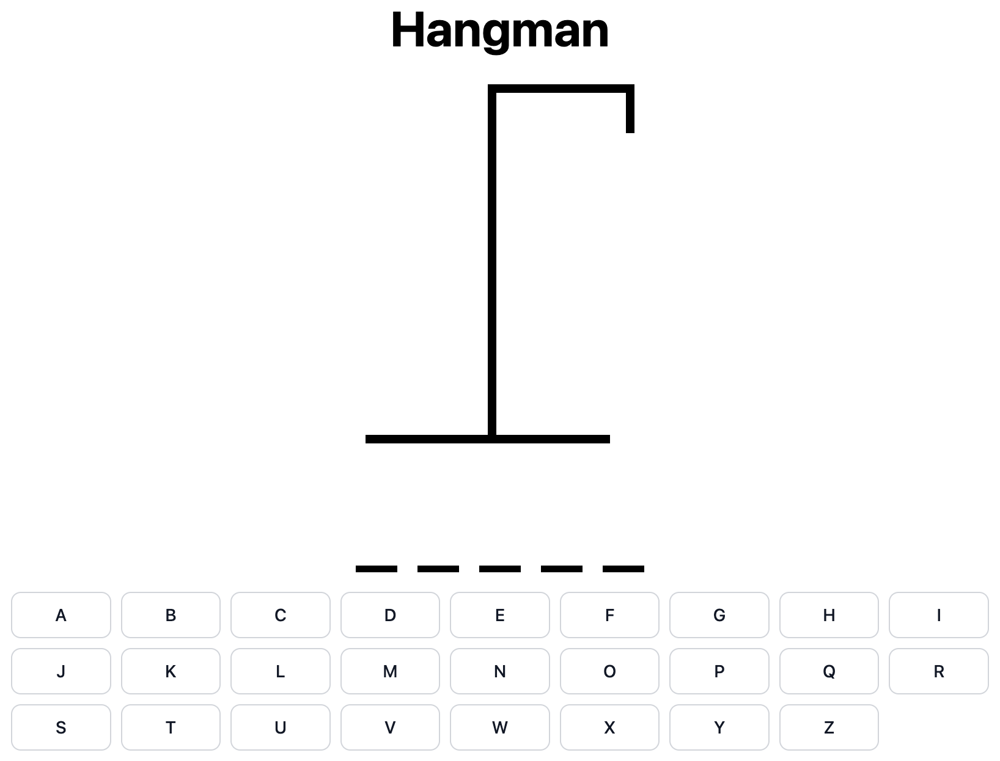
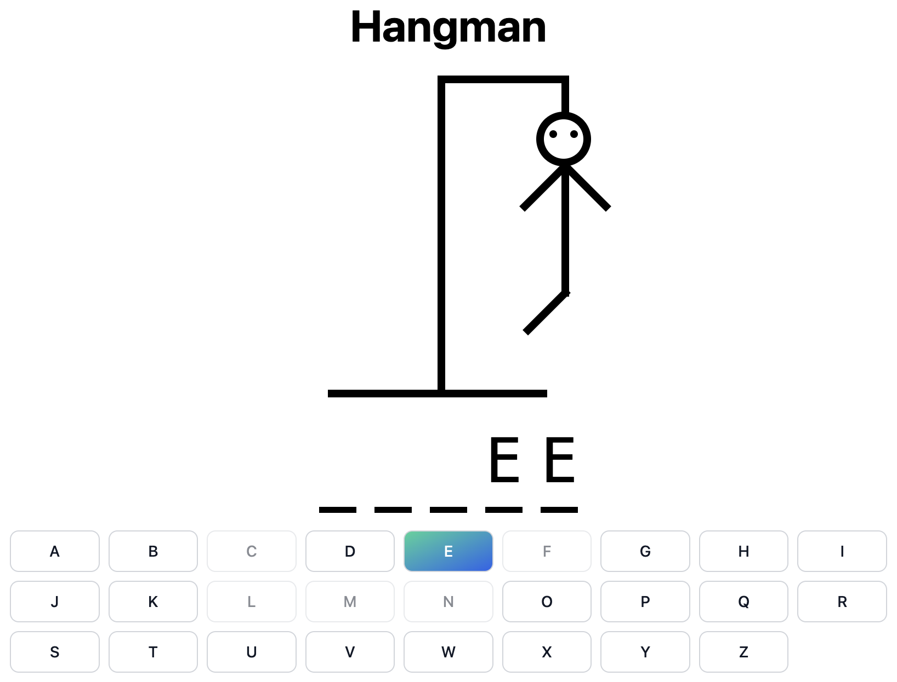
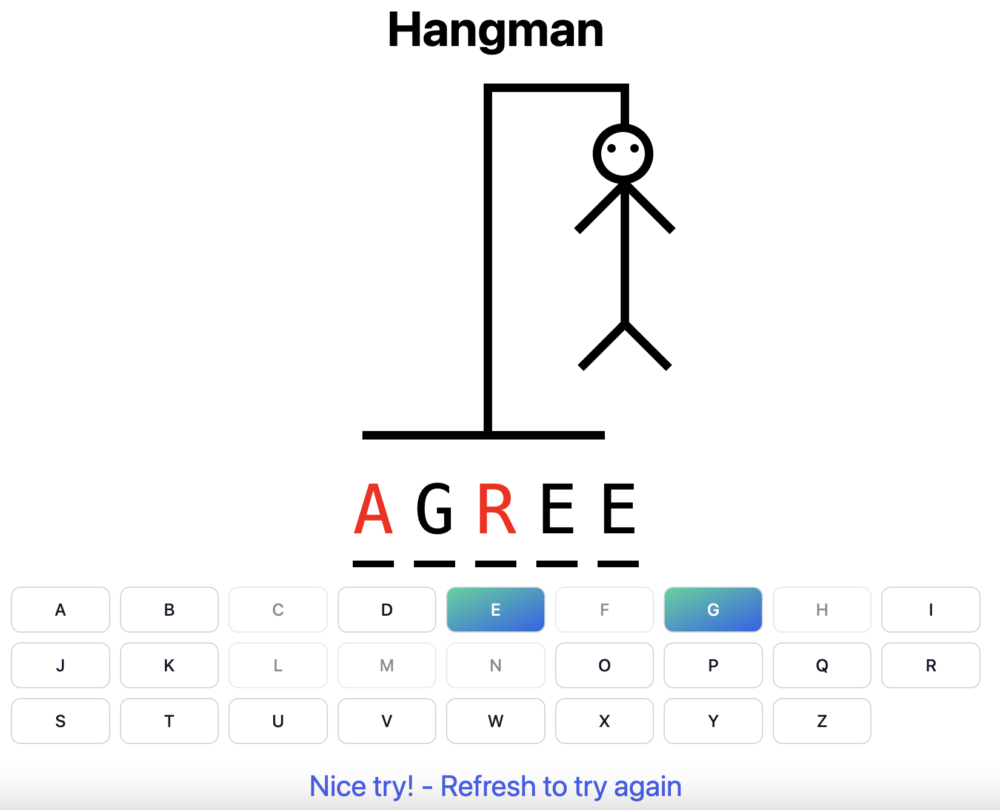

# Hangman Game

Welcome to Hangman! This is a classic game where you have to guess a word by suggesting letters within a limited number of attempts.

## How to Play

1. **Objective**: Guess the word before you run out of attempts.

2. **Gameplay**:
   - The game will randomly select a word.
   - You have 6 attempts to guess the word correctly.
   - Press a letter on your keyboard to guess. If the letter is in the word, it will be revealed; otherwise, you'll lose an attempt.
  
   - Once a letter is guessed, it will be disabled to prevent guessing the same letter again.
   - If you guess all the letters in the word correctly within 6 attempts, you win!
   - If you run out of attempts without guessing the word, you lose.

3. **End of Game**:
   - If you win, congratulations! You guessed the word correctly.
   - If you lose, don't worry! The correct word will be revealed, and the missing letters will be shown in red.
   - Refresh the page to play again.
   

## Technologies Used

- TypeScript
- React.js for UI development
- Tailwind CSS for styling
- Vite for development and build tooling

## Play Now

You can play the game directly [here](https://annietran2023.github.io/Hangman-React-TS) on GitHub Pages.

